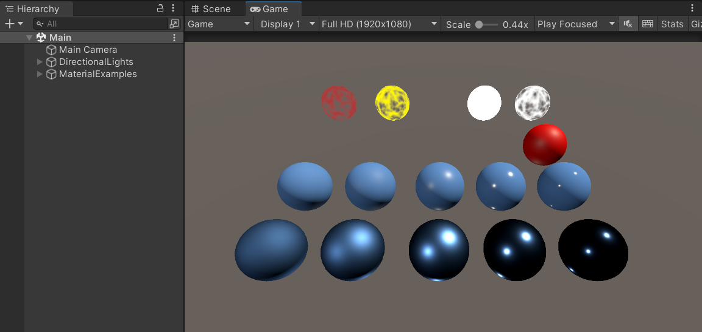
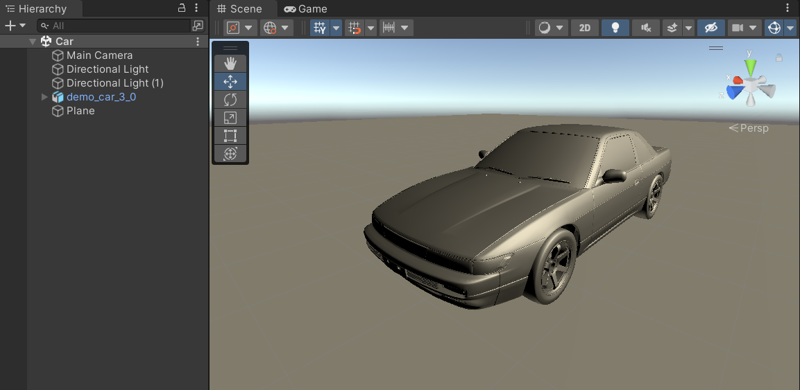

# Simple SRP example

This repo contains Unity sample (for 2021.3.19f1 version) which uses simple SRP implementation based on 3 first chapters of [Catlike Coding](https://catlikecoding.com/unity/tutorials/custom-srp/) tutors.

Examples of basic lit and unlit materials can be found in **Main** scene.

Imported car model is placed in **Car** scene.

